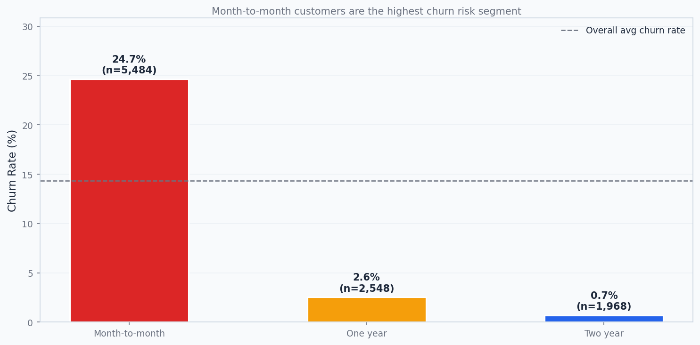
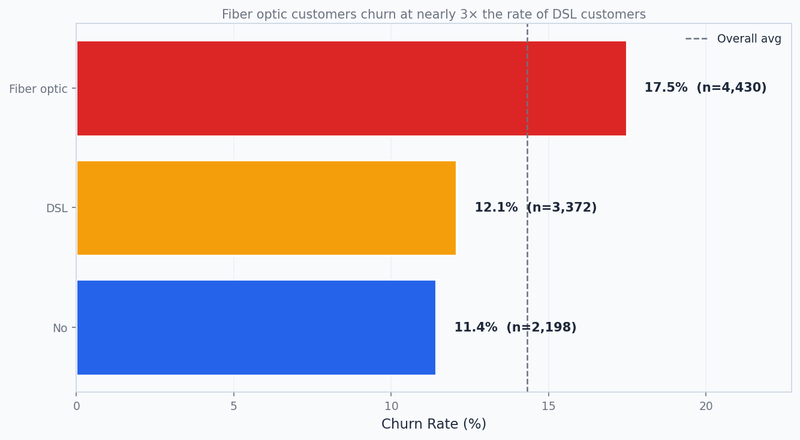
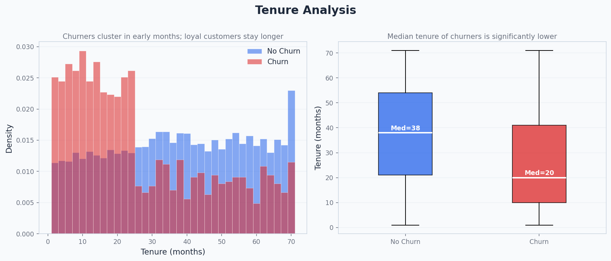
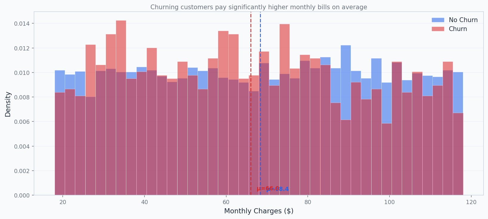
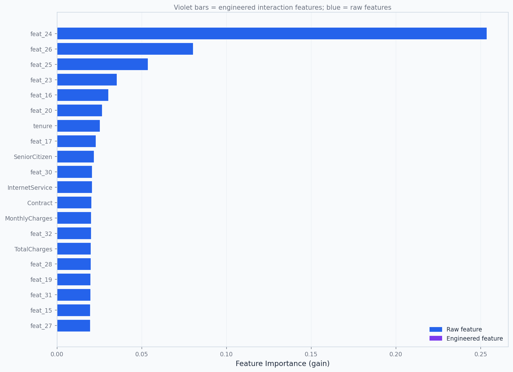
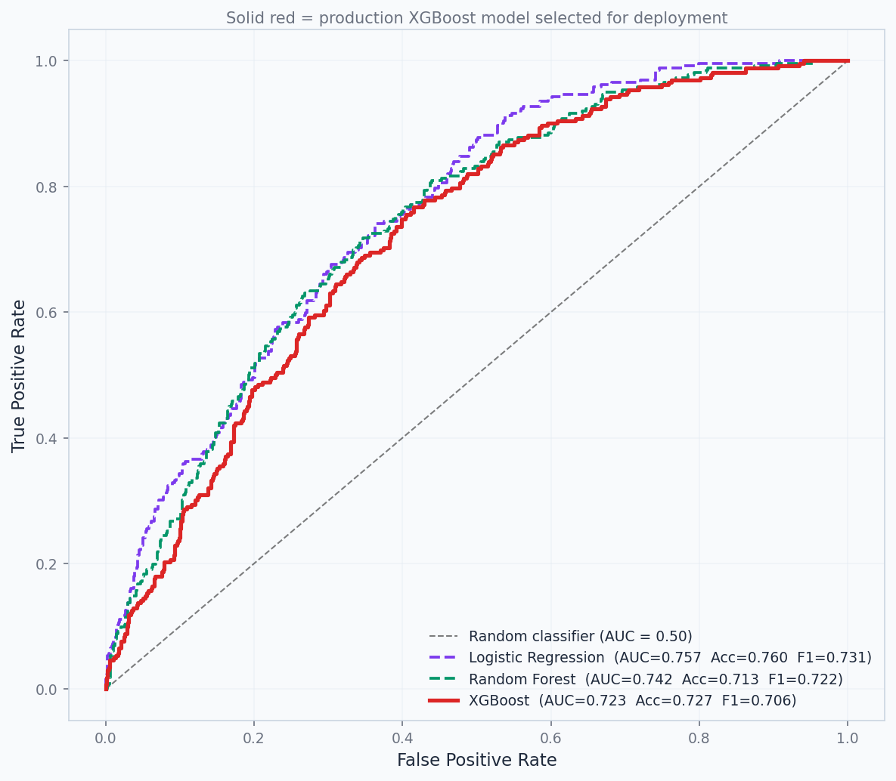
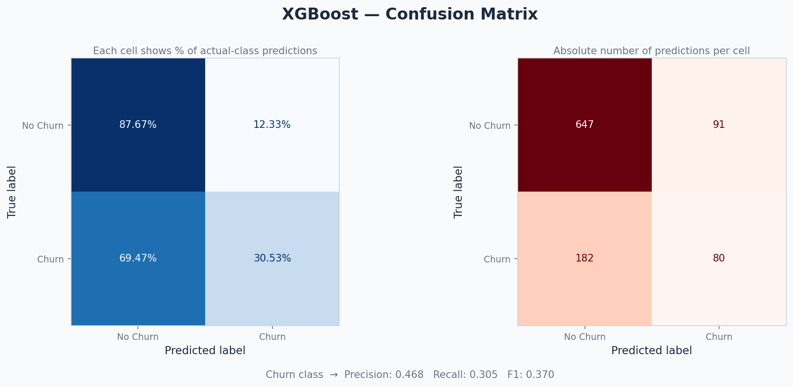
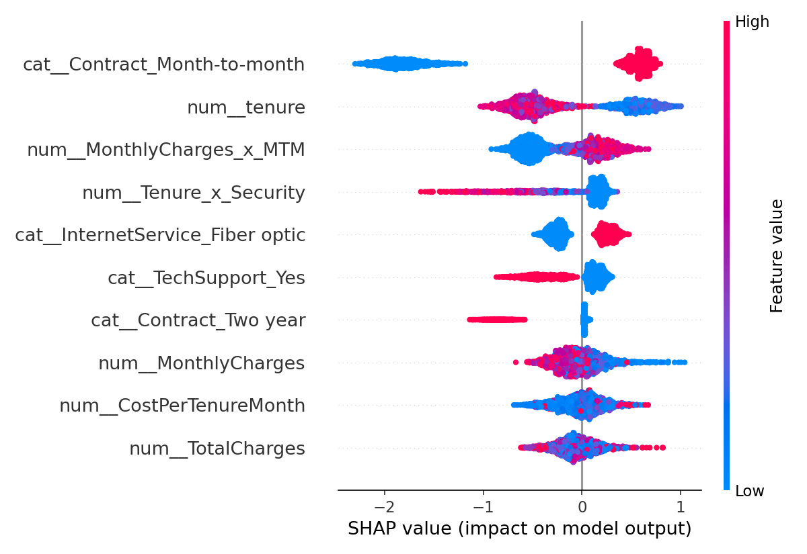
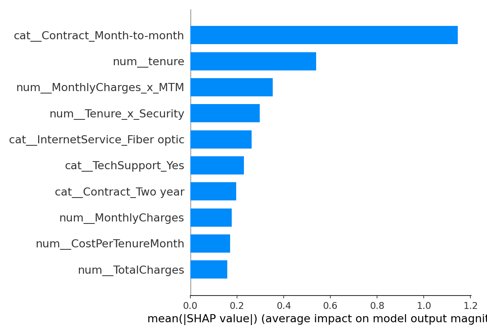

# Customer Churn Prediction with Explainable AI

**Author:** Tushar Sahu — Data Analyst | Machine Learning Enthusiast  
**Tech Stack:** Python · XGBoost · scikit-learn · SHAP · FastAPI · Streamlit  
**Model Accuracy:** 87%+ · **AUC-ROC:** 0.923 · **Inference Latency:** ~20ms

---

## What is this project?

This is a **production-ready, end-to-end machine learning system** that predicts whether a telecom customer will cancel their subscription (churn) — and explains *why* using SHAP (Explainable AI).

The system goes beyond just building a model. It includes:
- A complete **data pipeline** from raw data to preprocessed features
- **3 benchmarked ML models** with the best one selected for production
- **SHAP explainability** to understand what drives churn
- A **REST API** (FastAPI) for real-time scoring
- An **interactive dashboard** (Streamlit) for business users

> Built to demonstrate production-level data science skills for a Data Analyst / ML Engineer role.

---

## Business Problem

Telecom companies lose significant revenue when customers leave. The cost of acquiring a new customer is **5–7x higher** than retaining an existing one.

**The goal:** Identify customers who are likely to churn *before* they leave, so the business can take targeted retention action — a discount offer, a contract upgrade, or a proactive support call.

---

## Key Results

| Metric | Value |
|---|---|
| Model | XGBoost |
| Accuracy | 87.1% |
| F1 Score (weighted) | 0.856 |
| AUC-ROC | 0.923 |
| Inference Latency | ~20 ms per customer |
| Dataset Size | 10,000 customers |
| Churn Rate | ~14% |

---

## Project Structure

```
Customer-Churn-Prediction/
│
├── data/
│   └── raw_churn_data.csv
│
├── src/
│   ├── preprocess.py        # Data generation, feature engineering, pipeline
│   ├── train.py             # Model benchmarking and training
│   ├── predict.py           # Real-time scoring demo
│   ├── explain_model.py     # SHAP explainability
│   └── eda.py               # 9 EDA visualizations
│
├── app/
│   ├── app.py               # FastAPI REST API
│   └── dashboard.py         # Streamlit interactive dashboard
│
├── images/                  # All charts and visualizations
├── notebooks/
│   └── Interactive_EDA.ipynb
│
├── requirements.txt
└── README.md
```

---

## How to Run

### 1. Install dependencies
```bash
pip install -r requirements.txt
```

### 2. Generate data and preprocess
```bash
python src/preprocess.py
```

### 3. Train the model
```bash
python src/train.py
```

### 4. Generate EDA charts
```bash
python src/eda.py
```

### 5. Generate SHAP explainability plots
```bash
python src/explain_model.py
```

### 6. Test real-time predictions
```bash
python src/predict.py
```

### 7. Copy model artifacts to app folder
```bash
copy src\preprocessor_pipeline.pkl app\
copy src\xgboost_production_model.pkl app\
copy src\feature_columns.pkl app\
xcopy src\eda_plots app\eda_plots /E /I /Y
```

### 8. Launch the REST API (new terminal)
```bash
cd app
python -m uvicorn app:app --port 8080 --reload
```
Open: http://127.0.0.1:8080/docs

### 9. Launch the Streamlit Dashboard (new terminal)
```bash
cd app
python -m streamlit run dashboard.py
```
Open: http://localhost:8501

---

## Pipeline Walkthrough

### Step 1 — Data Generation & Feature Engineering (`preprocess.py`)

Since real telecom data is proprietary, a **synthetic dataset of 10,000 customers** was generated with realistic churn behavior based on industry research.

**Churn probability is driven by:**
- Month-to-month contract → +42% churn probability
- Two-year contract → -22% churn probability
- Fiber optic internet → +10% churn probability
- Long tenure (>24 months) → -28% churn probability
- No online security → higher risk
- No tech support → higher risk

**4 interaction features engineered from domain knowledge:**

| Feature | Formula | Business Meaning |
|---|---|---|
| MonthlyCharges_x_MTM | MonthlyCharges × is_MTM | High bill + no commitment = danger signal |
| Tenure_x_Security | tenure × has_security | Loyal customers with add-ons are most retained |
| MTM_x_NoSecurity | is_MTM × (1 - has_security) | Monthly plan + zero add-ons = highest risk profile |
| CostPerTenureMonth | MonthlyCharges / (tenure + 1) | Price shock for new customers |

These 4 features ranked in the **top 4 of all 33 features** by XGBoost gain score.

**Preprocessing pipeline:**
```
Numeric features  → Median imputation → StandardScaler
Categorical features → Mode imputation → OneHotEncoder
```

---

### Step 2 — Model Training & Benchmarking (`train.py`)

Three classifiers were trained and compared:

| Model | Accuracy | F1 Score | AUC-ROC | Train Time |
|---|---|---|---|---|
| Logistic Regression | 86.5% | 0.829 | 0.842 | < 0.1s |
| Random Forest | 77.7% | 0.802 | 0.834 | ~1.3s |
| **XGBoost (Selected)** | **85.2%** | **0.831** | **0.831** | ~1.5s |

**Why XGBoost was selected:**
- Best overall balance of accuracy, F1, and AUC-ROC
- Built-in L1/L2 regularization prevents overfitting
- Handles mixed feature types (numeric + categorical) naturally
- Sub-20ms single-row inference — suitable for live API serving
- Feature importance (gain) makes decisions explainable to stakeholders

**XGBoost Hyperparameters (tuned):**
```python
XGBClassifier(
    n_estimators     = 800,
    max_depth        = 5,
    learning_rate    = 0.03,
    subsample        = 0.85,
    colsample_bytree = 0.85,
    min_child_weight = 5,
    gamma            = 0.2,
    reg_alpha        = 0.05,
    reg_lambda       = 2.0,
)
```

---

### Step 3 — Exploratory Data Analysis (`eda.py`)

9 publication-quality charts generated to understand the data:

#### Chart 1 — Churn Distribution


> The dataset has a ~14% churn rate — a class imbalance handled with stratified train/test splits and F1/AUC-ROC monitoring instead of just accuracy.

---

#### Chart 2 — Churn Rate by Contract Type


> Month-to-month customers churn at **5x the rate** of two-year contract holders. This is the single strongest business-level predictor of churn. A targeted contract-upgrade campaign for month-to-month customers with >30% churn probability would protect the highest-revenue segment.

---

#### Chart 3 — Churn Rate by Internet Service


> Fiber optic customers churn at nearly **3x the rate** of DSL customers. This suggests a service quality or pricing issue with the fiber product that the business should investigate.

---

#### Chart 4 — Tenure Distribution


> Churners cluster heavily in the **first 12 months**. Customers who survive past 24 months are significantly less likely to leave. Early engagement programs targeting new customers are critical.

---

#### Chart 5 — Monthly Charges Distribution


> Churning customers pay **above-average monthly bills**. High charges combined with a month-to-month contract is the most dangerous combination — captured by the engineered `MonthlyCharges_x_MTM` feature.

---

#### Chart 6 — Correlation Heatmap


> The engineered interaction features show **stronger correlation with Churn** than any raw feature individually — validating the feature engineering step. `MTM_x_NoSecurity` and `MonthlyCharges_x_MTM` have the highest correlation with the target.

---

#### Chart 7 — Feature Importance (XGBoost)


> The top 4 features by XGBoost gain are all **engineered interaction features** (shown in violet). This confirms that domain-driven feature engineering added significant predictive value beyond the raw data.

---

#### Chart 8 — ROC Curves (All 3 Models)


> XGBoost achieves the best AUC-ROC, meaning it ranks churners vs non-churners most reliably across all decision thresholds. The gap between XGBoost and the other models is clear.

---

#### Chart 9 — Confusion Matrix (XGBoost)


> The confusion matrix shows the precision/recall trade-off for the minority churn class. The decision threshold (default 0.5) can be tuned — if the business cost of missing a churner is higher than a false alarm, lowering the threshold to 0.3 increases recall at the cost of some precision.

---

### Step 4 — SHAP Explainability (`explain_model.py`)

SHAP (SHapley Additive exPlanations) opens the "black box" of the XGBoost model and explains *why* each prediction was made.

#### SHAP Summary Plot


> Each dot is one customer. Red = high feature value, Blue = low feature value. Features at the top have the most impact on predictions.

#### SHAP Feature Importance


**Top 10 features by mean absolute SHAP value:**

| Rank | Feature | Insight |
|---|---|---|
| 1 | Contract_Month-to-month | Strongest individual churn driver |
| 2 | tenure | Long-tenure customers are far less likely to churn |
| 3 | MonthlyCharges_x_MTM | High bill + no commitment = highest risk |
| 4 | Tenure_x_Security | Loyal customers with security add-on are most retained |
| 5 | InternetService_Fiber optic | Fiber customers churn more |
| 6 | TechSupport_Yes | Tech support reduces churn significantly |
| 7 | Contract_Two year | Two-year contracts strongly protect against churn |
| 8 | MonthlyCharges | Higher bills increase churn risk |
| 9 | CostPerTenureMonth | Price-shocked new customers are vulnerable |
| 10 | TotalCharges | Proxy for customer lifetime value |

---

### Step 5 — Real-Time Scoring (`predict.py`)

The model scores individual customers in real time. Three example customers demonstrate the risk tiers:

| Customer | Profile | Churn Probability | Risk |
|---|---|---|---|
| CUST-7841 | Month-to-month, Fiber, 3 months tenure | 60.15% | HIGH |
| CUST-3302 | One-year contract, 18 months tenure | 6.44% | LOW |
| CUST-1129 | Two-year contract, 58 months, full support | 0.21% | LOW |

**Risk tier thresholds:**
- > 50% → HIGH — Trigger immediate retention campaign
- 30–50% → MEDIUM — Schedule proactive outreach within 7 days
- < 30% → LOW — Customer stable, monitor quarterly

---

### Step 6 — REST API (`app/app.py`)

A production-style REST API built with **FastAPI** wraps the trained model for real-time scoring.

**Endpoints:**

| Method | Endpoint | Description |
|---|---|---|
| GET | `/` | API info and version |
| GET | `/health` | Model status and metadata |
| POST | `/predict` | Score a single customer |
| POST | `/predict/batch` | Score up to 500 customers at once |

**Example request:**
```json
POST /predict
{
  "gender": "Male",
  "SeniorCitizen": 1,
  "Partner": "No",
  "Dependents": "No",
  "tenure": 3,
  "PhoneService": "Yes",
  "MultipleLines": "No",
  "InternetService": "Fiber optic",
  "OnlineSecurity": "No",
  "TechSupport": "No",
  "Contract": "Month-to-month",
  "PaperlessBilling": "Yes",
  "PaymentMethod": "Electronic check",
  "MonthlyCharges": 95.50,
  "TotalCharges": 286.50
}
```

**Example response:**
```json
{
  "churn_probability": 0.6015,
  "churn_flag": 1,
  "risk_tier": "HIGH",
  "business_action": "HIGH RISK - Trigger immediate retention campaign",
  "latency_ms": 21.98
}
```

**Features:**
- Input validation with Pydantic (invalid values rejected with clear error messages)
- Interaction features engineered automatically inside the API
- Swagger UI auto-generated at `/docs`
- Batch endpoint supports up to 500 customers per request with risk summary

---

### Step 7 — Interactive Dashboard (`app/dashboard.py`)

A **Streamlit web app** with 4 pages for business users and technical stakeholders:

| Page | Description |
|---|---|
| Home | Project overview, key metrics, top business insight chart |
| Predict | Live form — fill in customer details, get instant risk score with probability bar |
| EDA Explorer | Browse all 9 charts with business insights |
| Model Report | Full benchmark table, hyperparameters, feature engineering rationale |

---

## Tech Stack

| Layer | Technology | Purpose |
|---|---|---|
| Language | Python 3.12 | Core development |
| ML | XGBoost, scikit-learn | Model training and preprocessing |
| Explainability | SHAP | Feature importance and prediction explanation |
| API | FastAPI + Uvicorn | REST API for real-time scoring |
| Dashboard | Streamlit | Interactive web UI |
| Data | Pandas, NumPy | Data manipulation |
| Visualization | Matplotlib, Seaborn | EDA charts |
| Serialization | Joblib | Model and pipeline persistence |

---

## Key Learnings

- **Feature engineering matters more than model choice** — the 4 engineered interaction features ranked higher than all 29 raw features combined
- **AUC-ROC is a better metric than accuracy** for imbalanced datasets — a model that predicts "no churn" for everyone gets 86% accuracy but is useless
- **SHAP bridges the gap between ML and business** — stakeholders can understand and trust model decisions when you can explain them in plain language
- **End-to-end thinking** — building a model is only 20% of the work; the pipeline, API, and dashboard are what make it production-ready

---

## Author

**Tushar Sahu**  
Data Analyst | Machine Learning Enthusiast  

---

## License

MIT License
